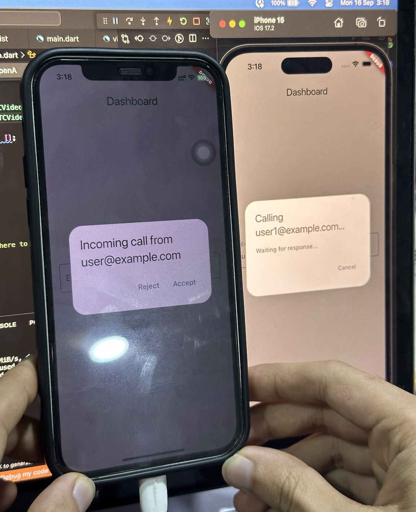

# Video Call App

1. **Signaling Phase**: Client-to-Server

   - Exchanges ICE candidates and metadata
   - Manages initial connection setup

2. **Media Exchange Phase**: Peer-to-Peer (P2P)
   - Direct communication between users
   - Ensures low-latency video and audio transmission

This approach combines the reliability of server-based signaling with the efficiency of P2P media transfer.

## Demo

